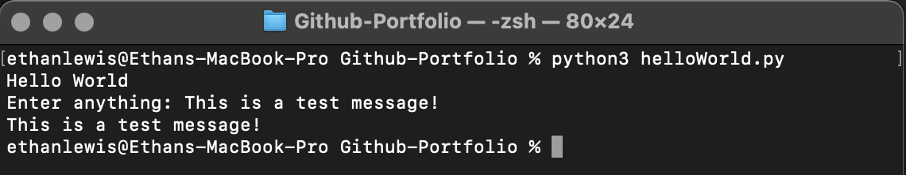

# Hello World User Prompt

#### Description and Content 
###### This simple Python program demonstrates basic input and output operations. The program initially prints “Hello World” to the screen, prompting the user with a friendly greeting. It then asks the user to enter any text and prints the user’s input back to the screen. This project is important as it displays the functionality of input prompts and print statements.

## Installation
To install and run this project locally, follow these steps:

1. **Clone the repository**:
    ```sh
    git clone https://github.com/ethanlewis938/Github-Portfolio
    ```

2. **Navigate to the project directory**:
    ```sh
    cd Github-Portfolio
    ```

3. **Run the program**:
    ```sh
    python hello_world.py
    ```

## Usage
After installing the project, you can use it by following these steps:

1. **Run the program**:
    ```sh
    python hello_world.py
    ```

2. **Interact with the program**:
    - The program will print `Hello World`.
    - It will then prompt you to `Enter anything:`.
    - Type any text you like and press Enter.
    - The program will print back the text you entered.

   **Example interaction:**
